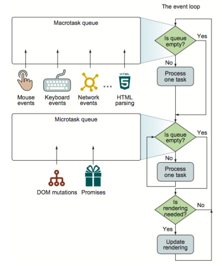

# Node & broswer Event Loop

### 为什么会有Event Loop

​	JavaScript的任务分为两种`同步`和`异步`，它们的处理方式也各自不同，**同步任务**是直接放在主线程上排队依次执行，**异步任务**会放在任务队列中，若有多个异步任务则需要在任务队列中排队等待，任务队列类似于缓冲区，任务下一步会被移到**调用栈**然后主线程执行调用栈的任务。

> **调用栈**：调用栈是一个栈结构，函数调用会形成一个栈帧，帧中包含了当前执行函数的参数和局部变量等上下文信息，函数执行完后，它的执行上下文会从栈中弹出。

​	JavaScript是`单线程`的，单线程是指 js引擎中解析和执行js代码的线程只有一个（主线程），每次只能做一件事情，然而`ajax`请求中，主线程在等待响应的过程中回去做其他事情，浏览器先在事件表注册ajax的回调函数，响应回来后回调函数被添加到任务队列中等待执行，不会造成线程阻塞，所以说js处理ajax请求的方式是异步的。

​	综上所述，检查调用栈是否为空以及讲某个任务添加到调用栈中的个过程就是event loop，这就是JavaScript实现异步的核心。


### 浏览器中的 Event Loop

##### Micro-Task 与 Macro-Task

浏览器端事件循环中的异步队列有两种：macro（宏任务）队列和 micro（微任务）队列。

常见的 macro-task：`setTimeout`、`setInterval`、`script（整体代码）`、` I/O 操作`、`UI 渲染`等。

常见的 micro-task: `new Promise().then(回调)`、`MutationObserve `等。


##### requestAnimationFrame

requestAnimationFrame也属于异步执行的方法，但该方法既不属于宏任务，也不属于微任务。按照[MDN](https://developer.mozilla.org/zh-CN/docs/Web/API/Window/requestAnimationFrame)中的定义：

> `window.requestAnimationFrame()` 告诉浏览器——你希望执行一个动画，并且要求浏览器在下次重绘之前调用指定的回调函数更新动画。该方法需要传入一个回调函数作为参数，该回调函数会在浏览器下一次重绘之前执行

requestAnimationFrame是GUI渲染之前执行，但在`Micro-Task`之后，不过requestAnimationFrame不一定会在当前帧必须执行，由浏览器根据当前的策略自行决定在哪一帧执行。


##### event loop过程



1. 检查macrotask队列是否为空，非空则到2，为空则到3
2. 执行macrotask中的一个任务
3. 继续检查microtask队列是否为空，若有则到4，否则到5
4. 取出microtask中的任务执行，执行完成返回到步骤3
5. 执行视图更新

> 当某个宏任务执行完后,会查看是否有微任务队列。如果有，先执行微任务队列中的所有任务，如果没有，会读取宏任务队列中排在最前的任务，执行宏任务的过程中，遇到微任务，依次加入微任务队列。栈空后，再次读取微任务队列里的任务，依次类推。


### node中的 Event Loop

Node 中的 Event Loop 和浏览器中的是完全不相同的东西。Node.js采用V8作为js的解析引擎，而I/O处理方面使用了自己设计的libuv，libuv是一个基于事件驱动的跨平台抽象层，封装了不同操作系统一些底层特性，对外提供统一的API，事件循环机制也是它里面的实现


根据上图node的运行机制如下

1. V8引擎解析JavaScript脚本。
2. 解析后的代码，调用Node API。
3. [libuv库](https://github.com/joyent/libuv)负责Node API的执行。它将不同的任务分配给不同的线程，形成一个Event Loop（事件循环），以异步的方式将任务的执行结果返回给V8引擎。
4. V8引擎再将结果返回给用户。


##### 六大阶段

其中libuv引擎中的事件循环分为 6 个阶段，它们会按照顺序反复运行。每当进入某一个阶段的时候，都会从对应的回调队列中取出函数去执行。当队列为空或者执行的回调函数数量到达系统设定的阈值，就会进入下一阶段。


1. `timers` 阶段：这个阶段执行timer（setTimeout、setInterval）的回调，并且是由 poll 阶段控制的。
2. `I/O callbacks` 阶段：处理一些上一轮循环中的少数未执行的 I/O 回调
3. `idle, prepare` 阶段：仅node内部使用
4. `poll` 阶段：获取新的I/O事件, 适当的条件下node将阻塞在这里
5. `check` 阶段：执行 setImmediate() 的回调
6. `close callbacks` 阶段：执行 socket 的 close 事件回调


#####  poll阶段

poll 是一个至关重要的阶段，这一阶段中，系统会做两件事情

1.回到 timer 阶段执行回调

2.执行 I/O 回调

并且在进入该阶段时如果没有设定了 timer 的话，会发生以下两件事情

- 如果 poll 队列不为空，会遍历回调队列并同步执行，直到队列为空或者达到系统限制
- 如果 poll 队列为空时，会有两件事发生
  - 如果有 setImmediate 回调需要执行，poll 阶段会停止并且进入到 check 阶段执行回调
  - 如果没有 setImmediate 回调需要执行，会等待回调被加入到队列中并立即执行回调，这里同样会有个超时时间设置防止一直等待下去

当然设定了 timer 的话且 poll 队列为空，则会判断是否有 timer 超时，如果有的话会回到 timer 阶段执行回调。


##### Micro-Task 与 Macro-Task

Node端事件循环中的异步队列也是这两种：macro（宏任务）队列和 micro（微任务）队列。

- 常见的 macro-task 比如：`setTimeout`、`setInterval`、 `setImmediate`、`script（整体代码`）、` I/O 操作等`。
- 常见的 micro-task 比如: `process.nextTick`、`new Promise().then(回调)`等。


##### setTimeout 和 setImmediate

二者非常相似，区别主要在于调用时机不同。

- setImmediate 设计在poll阶段完成时执行，即check阶段；
- setTimeout 设计在poll阶段为空闲时，且设定时间到达后执行，但它在timer阶段执行

```javascript
setTimeout(function timeout () {
  console.log('timeout');
},0);
setImmediate(function immediate () {
  console.log('immediate');
});
```

1. 对于以上代码来说，setTimeout 可能执行在前，也可能执行在后。
2. 首先 setTimeout(fn, 0) === setTimeout(fn, 1)，这是由源码决定的 进入事件循环也是需要成本的，如果在准备时候花费了大于 1ms 的时间，那么在 timer 阶段就会直接执行 setTimeout 回调
3. 如果准备时间花费小于 1ms，那么就是 setImmediate 回调先执行了


#####  process.nextTick

这个函数其实是独立于 Event Loop 之外的，它有一个自己的队列，当每个阶段完成后，如果存在 nextTick 队列，就会清空队列中的所有回调函数，并且优先于其他 microtask 执行


### Node与浏览器的 Event Loop 差异


- Node端，microtask 在事件循环的各个阶段之间执行
- 浏览器端，microtask 在事件循环的 macrotask 执行完之后执行


### 参考链接

https://zhuanlan.zhihu.com/p/24460769

http://www.ruanyifeng.com/blog/2013/10/event_loop.html

https://nodejs.org/en/docs/guides/event-loop-timers-and-nexttick/

https://cnodejs.org/topic/57d68794cb6f605d360105bf

